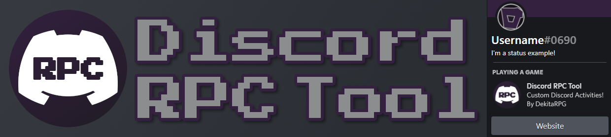
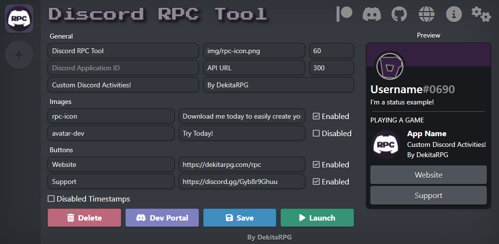
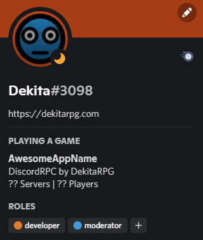
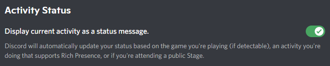
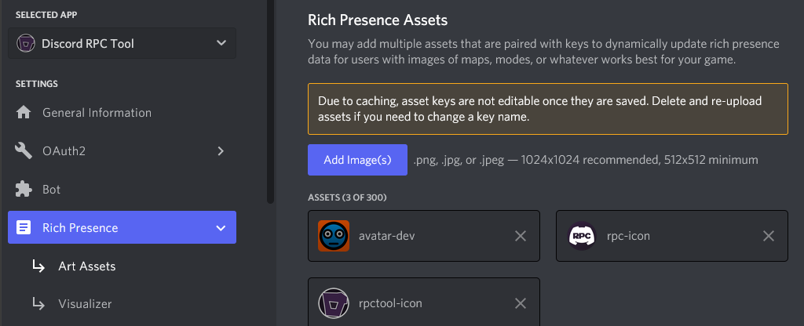

[](https://dekitarpg.com/rpc)

<div class="d-flex mb-2">
<div class="mx-auto d-block">
    
    <a class="mx-2" href="https://discord.gg/7dCZ3Q4eU3" target="new">
        
    </a>
    
</div>
</div>

### Table of Contents
- [How to install](#how-to-install) 
- [What is Discord RPC Tool](#what-is-discord-rpc-tool) 
- [RPC Tool Features](#rpc-tool-features) 
- [Latest Changelog](#changelog-v0095) 
- [Launching your first activity](#launching-your-first-activity) 
- [Main Activity Customization](#main-activity-customization) 
- [Activity Image Customization](#activity-image-customization) 
- [Activity Button Customization](#activity-button-customization) 
- [Advanced Activity Text](#advanced-activity-text) 
- [Important Notes](#important-notes) 

<hr class="mt-1">

### What is Discord RPC Tool
RPC Tool is a simple application that allows you to easily communicate with the Discord `Rich Presence Client`. RPC is a service that the Discord application installed on your machine enables. The RPC allows other applications, like this one, to communicate with the running Discord app. RPC Tool uses this feature to set the user currently logged into Discord's `Now Playing` activity.


<hr class="mt-1">

### RPC Tool Features
- Painless Installation
- Multiple Activity Profiles
- Modern UI Inspired by Discord
- Multi Platform Support (win+linux)
- Customizable Theme + Multiple Defaults 
- Auto Detect App Name, Icon, Description, etc
- Optional Minimize to System Tray
- Optional Auto Start Activity on Launch
- Optional Auto Minimize App on Launch
- Optional Auto Launch App on System Boot
- API Polling for Advanced Activities
- Optional Activity Duration/Timer
- System Notifications
<hr class="mt-1">

### Changelog (v0.0.95)
- Bugfix for app id not properly registering
- Activities can now be moved position using drag+drop
- Theme menu moved changed from window to modal
- New theme randomization types powered by colormind.io
- Various theme customization gui improvements
- Added replacers for time/date/locale/timezone/playtime
- Fixed support server links and added to help guide
- Seperated code chunks for future refactor
- Added api polling for user counts
- Scrollbar styling improvements
- New 'toast' style alerts
<hr class="mt-1">

### Changelog (v0.0.94)
- Bugfix for application images not being reloaded
- Bugfix for additional activities not refreshing images
- New button to refresh application details (at app id)
- New button to use application icon as activity image in app
- New buttons to pull details and summary from application data
<hr class="mt-1">

### Changelog (v0.0.93)
- Added save as custom theme option to theme creator
- Update notifications altered
- Added 10 new theme styles 
<hr class="mt-1">

### Changelog (v0.0.92)
- Automatic Updater - make sure your always on the latest version
- New theme creator - make the app look how you want it
- System Notifications - if your activity stops, now you know
- App now hosted on github, no more gumroad.  
<hr class="mt-1">

### Changelog (v0.0.91)
- Load application name and assets from app id
- Image key input area changed to asset dropdown
- Added theme options based on discord (x2 dark, x2 light)
- Altered gui elements to be more in line with discord.
- Removed activity name (was only used in the RPC Tool app)
- Moved API URL and Frequency settings into advanced section
- Updated preview display to use image assets
<hr class="mt-1">

### Coming Soon / TODO
- Change logic to allow for 'real-time' preview
- Switch everything to es style modules 
- Configurable auto-save option
- More awesome themes
- ...
<hr class="mt-1">


### How to install 
<a href="https://github.com/Dekita/Discord-RPC-Tool/releases/latest" target="new">
Click Here To Download!!
</a>

Once downloaded extract and then run the installer.

Discord RPC Tool is now installed on your pc.

<hr class="mt-1">

### How to install (development)
| :exclamation: Node.js is required for development |
|---|

```
git clone https://github.com/Dekita/Discord-RPC-Tool.git
```
```
cd Discord-RPC-Tool
```
```
npm i; npm start
```
<hr class="mt-1">

### Launching your first activity
Once the application is installed and running on your machine, click on the purple `Dev Portal` button. This will open the discord developer portal. Once logged into the dev portal, create a new application and name it whatever you want. This is the name that will be shown for your activity.

While on the `General Information` tab, after naming your application, copy the  `Application ID` and paste it into the `Discord Application ID` input field in RPC Tool's general configuration area.

After entering your unique app id, press the `Save`, then `Launch` buttons. After a second or so, your user profile card on Discord should now look similar to this:



:exclamation: If the activity is not showing on your user profile card, make sure that you are not showing as invisible/offline, and that you have enabled `Activity Status` within the discord application's user settings. 



<hr class="mt-1">

### Main Activity Customization
Once you have launched your first activity, you are ready to begin properly customizing things. See the details below for each customizable option.
<hr class="mt-1">

###### Application ID 
Should be set to your discord application id. You can get this from the Discord developer portal after you create your application.
<hr class="mt-1">

###### Activity Image [default=`src/img/icon.png`]
This used only for the RPC Tool application. The selected image is used only for the Activity icon within the application interface. 
<hr class="mt-1">

###### Activity Text: Line 1 + 2
Text shown for the activity details and state (the first and second line of text shown below your app name on your profile card). 
<hr class="mt-1">

### Activity Image Customization
Each activity can display upto two images, one large and one small. But before RPC Tool can display them properly, the image files must be uploaded onto the Discord developer portal's `Rich Presence => Art Assets` tab shown below. 


| :exclamation: Images may take a few minutes to show due to discords cache |
|---|

The image key that you enter on the developer portal should match the image key you select in the RPC Tool application. After adding new images on the dev portal, click the `refresh application data` button in the RPC tool (next to the app id input) to refresh refresh image datas. If they arent showing, wait a few minutes, and try again. If still not showing, refresh the developer portal to make sure discord has saved them properly.

Make sure to also enable your image within the RPC Tool application. 

<hr class="mt-1">

### Activity Button Customization

| :exclamation: Your own activity buttons do not work for you, only other users! |
|---|

Each activity can also display upto two customizable buttons. Each enabled button must have a valid url and name or discord will not be able to process it correctly. Similar to activity images, buttons can easily be enabled and disabled.
<hr class="mt-1">

###### Custom API URL

| :exclamation: This feature is optional. Don't know what it does? You dont need it! |
|---|

Set this to a url that returns valid json data, then you can use the returned json object properties when setting your activity text. [[see here for details]](#advanced-activity-text)

<hr class="mt-1">

###### API Update Frequency [default=`300`]
The frequency in seconds for how often the application should poll the `Custom API URL` for its json data.
<hr class="mt-1">

###### RPC Update Frequency [default=`15`]
The frequency in seconds for how often the application should send data to the Discord Rich Presence Client.
<hr class="mt-1">

###### Activity Timestamps
Shows the duration that the current activity has been active.
<hr class="mt-1">

### Advanced Activity Text

| :exclamation: Advanced Feature ~ Also the reason RPC Tool was created! |
|---|

If you have [[Custom API URL]](#custom-api-url) set to some endpoint that returns a valid json object, then you are able to use the properties of the returned object to replace parts of your activity text. For example, lets say your api url returns the following json object:
```json
{"players": 99, "servers": 3}
```
You can use these returned properties (`players` and `servers`) within your activity text by wrapping the property name in curly braces `{}`. 

Assuming the example json above, along with the following activity text: 
`{servers} Servers | {players} Players` 

Then the resulting text shown for the activity would be: 
`3 Servers | 99 Players` 

Additionally, there are a number of default replacers that you can use, without any api url, that will use app/system information. See below for more details;
`{date}` - formatted date
`{date-tz}` - formatted date with timezone
`{time}` - formatted time
`{time-tz}` - formatted time with timezone
`{region}` - your estimated region
`{timezone}` - your estimated timezone
`{playtime}` - logical playtime text
`{playtime-short}` - short playtime text
`{rpc-website}` - rpc website url
`{rpc-support}` - rpc support server url
<hr class="mt-1">

### Important Notes
| :exclamation: Your own activity buttons do not work for you, only other users! |
|---|

| :exclamation: Always save after making changes or they wont take effect! |
|---|

| :warning: Please report any bugs you find to the support server! |
|---|
